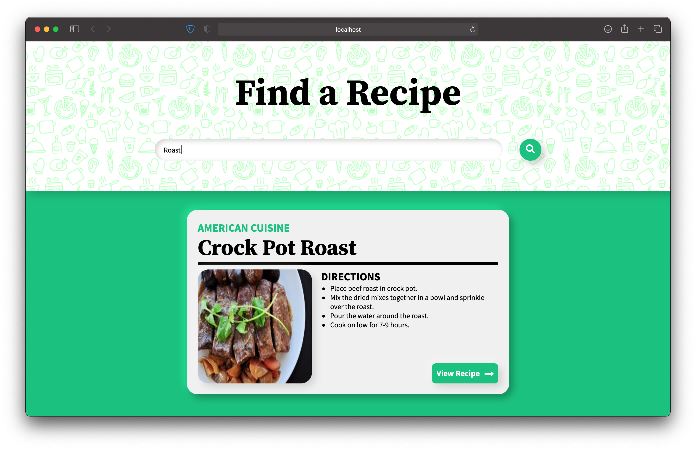

## shelf-dart (GitHub App)



   This repository is a sample project for Dart organization as part of GSoC'21. This is a simple recipe app that allows the user to search for recipes both through web app and REST api. The project is served using Shelf. The dart code is compiled to Javascript and powers the search engine behind the rendered HTML page. All static files required for web app are served through shelf.

## Requirements

- [x] Make a webserver using [Shelf](https://pub.dev/packages/shelf).
- [x] Render HTML templates.
- [x] Convert Dart to JS for use client-side.
- [x] Handle REST requests.
- [x] Serve files from disk.

## API Documentation

There are two API routes:


### 1. List all recipes
**GET** api/recipe/

#### Query Params

- Search recipes based on the recipe name: *?name={name}*

#### Headers:

- Content-Type: application/json

#### Response:

```json
[
   {
      "id":8,
      "name":"Curried chicken salad",
      "steps":[
         "ARRANGE chicken in a single layer in a large pot.",
         "Add water to just cover.",
         "Bring to a boil over medium-high."
      ],
      "imageURL":"http://www.chatelaine.com/wp-content/uploads/2013/05/Curried-chicken-salad.jpg",
      "originalURL":"http://www.chatelaine.com/recipe/stovetop-cooking-method/curried-chicken-salad/"
   },
   {
      "id":10,
      "name":"Roasted Asparagus",
      "steps":[
         "Preheat oven to 425°F.",
         "Cut off the woody bottom part of the asparagus spears and discard."
      ],
      "imageURL":"http://img.sndimg.com/food/image/upload/w_266/v1/img/recipes/50/84/7/picMcSyVd.jpg",
      "originalURL":"http://www.food.com/recipe/roasted-asparagus-50847"
   }
]
```

### 2. Get a recipe based on primary key

**GET** api/recipe/<id>


#### Headers:

- Content-Type: application/json

#### Response:

```json
{
   "id":1,
   "name":"Crock Pot Roast",
   "steps":[
      "Place beef roast in crock pot.",
      "Pour the water around the roast.",
      "Cook on low for 7-9 hours."
   ],
   "imageURL":"http://img.sndimg.com/food/image/upload/w_266/v1/img/recipes/27/20/8/picVfzLZo.jpg",
   "originalURL":"http://www.food.com/recipe/to-die-for-crock-pot-roast-27208"
}
```

## Setting up and running server

1. Download and install [latest version of git](https://git-scm.com/downloads).
2. Clone the repository locally
     ```shell script
    $ git clone https://github.com/Diaga/shelf-dart.git
    ```
3. Setup environment
    ```shell script
    $ dart pub get
    $ npm i -g nodemon
    ```
4. Run server through nodemon to watch for changes in source files and restart server automatically
    ```shell script
    $ nodemon
    ```
   If watching for changes is not required, use the following command to run server
   ```shell script
    $ dart run
    ```

## Project Structure

```shell
- lib
   - api # Holds api logic
      - managers.dart # Defines data access objects for models
      - models.dart # Defines models
      - models.g.dart # Generated code to convert models to JSON
      - urls.dart
      - views.dart
   - app # Holds web app logic
      - templates # Holds HTML templates and Dart to JS Logic 
      - urls.dart # Defines urls for this app and appropriate views for each URL.
      - views.dart # Defines views/business logic for this app
   - package_name
      - bootstrap.dart # Registers URLs and middlewares with HTTP handler
      - middlewares.dart # Defines custom middlewares
      - settings.dart # Defines constants and settings such as hostname, port, list of middlewares to include etc.
```

## License 
- [MIT](https://github.com/Diaga/shelf-dart/blob/master/LICENSE).
- Created from templates made available by Stagehand under a BSD-style
[license](https://github.com/dart-lang/stagehand/blob/master/LICENSE).
